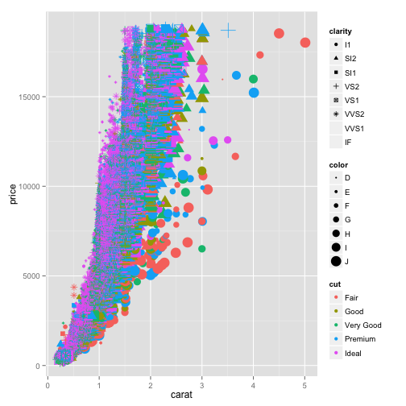

## Quick Pitch for Diamond Price Prediction App

### What:  Web based App that allows users reliable diamond pricing

### Why:  

1. Rediculously easy to use Interface
2. Web based.  Easy to update and deploy
3. Built with Shiny.  Enough said.

--- .class #id 

## Load and PreProcess the Dataset for Exploration, Analysis and Modeling


```r
library(ggplot2)
names(diamonds)
```

```
##  [1] "carat"   "cut"     "color"   "clarity" "depth"   "table"   "price"  
##  [8] "x"       "y"       "z"
```

```r
# reduce the variables to the 4 c's and price
dia.small <- select(diamonds, -c(x:z, depth, table))
dia.small$cut <- as.integer(dia.small$cut)
dia.small$color <- as.integer(dia.small$color)
dia.small$clarity <- as.integer(dia.small$clarity)
```

---

## Explore The Data

```r
qplot(x = carat, y = price, data = dia.small, color = cut, shape = clarity, size = color)
```

 

---

## Build and Evaluate The Model

```r
inTrain <- createDataPartition(y = dia.small$price, p = .70, list=FALSE)
dia.train <- dia.small[inTrain, ]
dia.test <- dia.small[-inTrain, ]

model.fit <- train(price ~ ., data = dia.train, method = "lm")
summary(model.fit$finalModel)
```

```
## 
## Call:
## lm(formula = .outcome ~ ., data = dat)
## 
## Residuals:
##      Min       1Q   Median       3Q      Max 
## -19799.6   -695.8   -167.4    556.8   9002.3 
## 
## Coefficients:
##              Estimate Std. Error t value Pr(>|t|)    
## (Intercept) -4669.648     33.031 -141.37   <2e-16 ***
## carat        8800.468     15.177  579.86   <2e-16 ***
## cut           159.007      5.815   27.35   <2e-16 ***
## color        -327.108      3.942  -82.98   <2e-16 ***
## clarity       527.617      4.222  124.98   <2e-16 ***
## ---
## Signif. codes:  0 '***' 0.001 '**' 0.01 '*' 0.05 '.' 0.1 ' ' 1
## 
## Residual standard error: 1235 on 37754 degrees of freedom
## Multiple R-squared:  0.9044,	Adjusted R-squared:  0.9044 
## F-statistic: 8.933e+04 on 4 and 37754 DF,  p-value: < 2.2e-16
```

```r
preds <- predict(model.fit, newdata = dia.test)
qplot(price, preds, data = dia.test)
```

 


